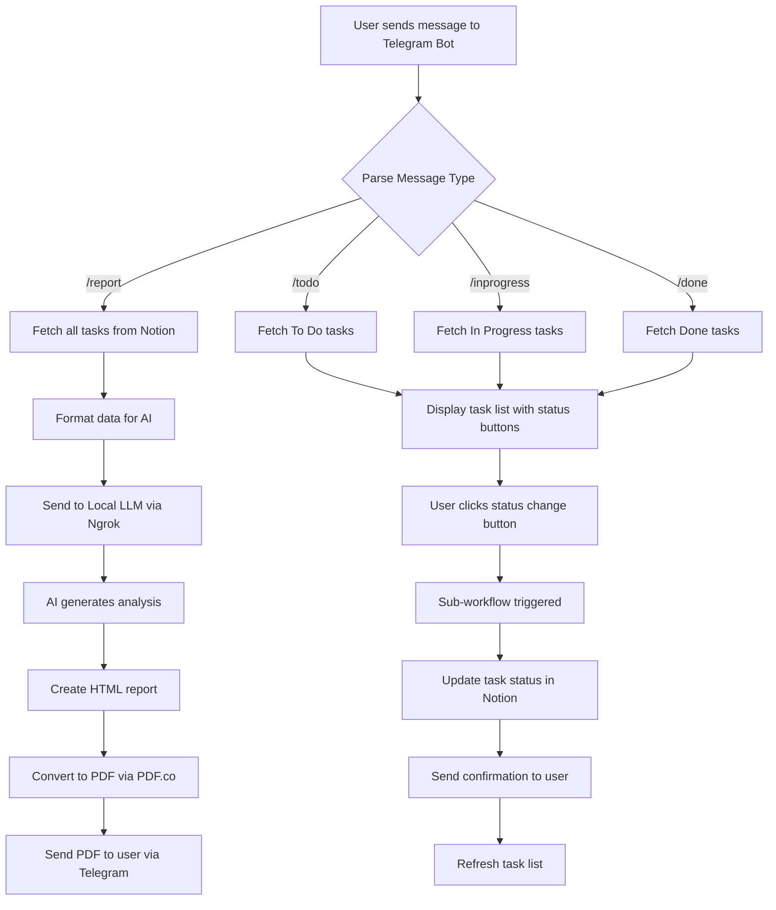

# 📋 AI-Powered Telegram Task Management Bot

> An intelligent task management system that integrates Notion, Telegram, Local AI, and automated PDF report generation to help you monitor and manage your daily tasks efficiently.

---

## 🎯 Project Objective

This workflow provides a comprehensive solution for **real-time task monitoring and management** through Telegram, with AI-powered daily reports. The system allows you to:

- ✅ Monitor daily tasks and their completion status in real-time
- 🔄 Move tasks between different statuses (To Do, In Progress, Done) with a single click
- 📊 Generate AI-powered task analysis reports with actionable insights
- 📱 Manage everything directly from Telegram - no need to open multiple apps
- 🤖 Leverage local AI for intelligent task analysis and recommendations

---

## 🛠️ Tech Stack & Integrations

### Core Technologies

| Component | Purpose | Details |
|-----------|---------|---------|
| **n8n** | Workflow Automation | Version 2.4.8+ running on Sumopod |
| **Notion** | Task Database | Stores and organizes all task data |
| **Telegram Bot API** | User Interface | Interactive chat interface for task management |
| **LM Studio** | Local AI Server | Hosts the AI model for report generation |
| **Llama 3.2 3B Instruct** | AI Model | Generates intelligent task analysis and insights |
| **PDF.co API** | PDF Generation | Converts HTML reports to professional PDFs |
| **Ngrok** | Local Tunneling | Exposes local LM Studio to cloud n8n instance |

### External Services
- **Notion API** - Task database management
- **Telegram Bot API** - Message handling and bot interactions
- **PDF.co** - HTML to PDF conversion (free tier: 300 calls/month)
- **Ngrok** - Secure tunnel for local LLM access

---

## 📁 Project Structure

```
telegram-task-manager/
├── workflows/
│   ├── Telegram_Workflow_1.json           # Main workflow (Trigger & Report Generation)
│   └── Sub__Telegram_Workflow_1__-_1.json # Callback workflow (Button interactions)
├── README.md                               # This file
├── .env.example                            # Environment variables template
└── docs/
    ├── setup-guide.md                      # Detailed setup instructions
    ├── workflow-diagram.png                # Visual workflow diagram
    └── screenshots/                        # UI screenshots
```

---

## 🔄 Workflow Architecture

### Workflow 1: Main Trigger & Report Generator
**File:** `Telegram_Workflow_1.json`

**Responsibilities:**
- 📥 Receives incoming messages from Telegram
- 🎯 Routes commands to appropriate actions
- 📊 Generates AI-powered task reports
- 📄 Creates and sends PDF reports

**Trigger:** Telegram Webhook

### Workflow 2: Callback Handler
**File:** `Sub__Telegram_Workflow_1__-_1.json`

**Responsibilities:**
- 🔘 Handles button clicks and inline keyboard interactions
- 🔄 Processes task status updates
- 📋 Manages task list navigation
- ✏️ Updates Notion database based on user actions

**Trigger:** Sub-workflow call from Workflow 1

---

## 📊 Business Process Flow



---

## 🎮 User Commands & Features

### Available Commands

| Command | Description | Response |
|---------|-------------|----------|
| `/start` | Initialize the bot | Welcome message with command list |
| `/report` | Generate AI-powered task report | PDF report with statistics and AI insights |
| `/todo` | View tasks in "To Do" status | Interactive list with status change buttons |
| `/inprogress` | View tasks in "In Progress" status | Interactive list with status change buttons |
| `/done` | View completed tasks | Interactive list with status change buttons |

### Interactive Features

- **Status Change Buttons:** Click to move tasks between statuses
  - To Do → In Progress
  - In Progress → Done
  - Done → To Do (reopen task)
  
- **Real-time Updates:** Task lists refresh after each status change

- **Visual Indicators:**
  - 📝 To Do
  - 🔄 In Progress
  - ✅ Done

---

## 📈 AI-Generated Report Features

### Report Sections

1. **Overview Statistics**
   - Total tasks count
   - Status breakdown (To Do, In Progress, Done)
   - Completion rate percentage
   - Visual progress charts

2. **Detailed Task Table**
   - Sorted by: Status → Priority → Due Date
   - Columns: Due Date, Task Name, Priority, Category, Status
   - Color-coded priority indicators (🔴 High, 🟡 Medium, 🟢 Low)
   - Status badges with emojis

3. **AI Analysis (Generated by Llama 3.2)**
   - **Executive Summary** - Overall performance overview
   - **Key Insights** - Productivity patterns and trends
   - **Recommendations** - Actionable task prioritization advice
   - **Risk Assessment** - Deadline concerns and bottleneck identification

### Report Format
- **File Type:** PDF (A4 format)
- **Design:** Professional gradient design with charts
- **Delivery:** Sent directly to Telegram chat
- **Generation Time:** ~15-30 seconds

---

## 🚀 Setup & Installation

### Prerequisites

- ✅ n8n instance (self-hosted or cloud like Sumopod)
- ✅ Notion account with API access
- ✅ Telegram account
- ✅ LM Studio installed locally (for MacOS/Windows/Linux)
- ✅ Ngrok account (free tier)
- ✅ PDF.co account (free tier)

### Step 1: Notion Setup

1. **Create Notion Database** with these properties:
   - `Name` (Title) - Task name
   - `Status` (Select) - Options: To do, In progress, Done
   - `Priority` (Select) - Options: High, Medium, Low
   - `Category` (Select) - Options: Work, Personal
   - `Due Date` (Date) - Task deadline

2. **Get Notion API Key:**
   - Go to https://www.notion.so/my-integrations
   - Create new integration
   - Copy the Internal Integration Token
   - Share your database with the integration

3. **Get Database ID:**
   - Open your database in Notion
   - Copy the ID from URL: `notion.so/workspace/{database_id}?v=...`

### Step 2: Telegram Bot Setup

1. **Create Bot:**
   - Message @BotFather on Telegram
   - Send `/newbot`
   - Follow prompts to name your bot
   - Copy the bot token (format: `123456789:ABCdefGHIjklMNO...`)

2. **Get Your Chat ID:**
   - Message your bot
   - Visit: `https://api.telegram.org/bot<YOUR_BOT_TOKEN>/getUpdates`
   - Find `"chat":{"id":123456789}` in response

### Step 3: LM Studio Setup

1. **Install LM Studio:**
   - Download from: https://lmstudio.ai/
   - Install for your OS

2. **Download Model:**
   - Open LM Studio
   - Search for "llama-3.2-3b-instruct"
   - Download the model

3. **Start Local Server:**
   - Go to "Local Server" tab
   - Select llama-3.2-3b-instruct
   - Click "Start Server"
   - Verify running on `http://localhost:1234`

### Step 4: Ngrok Setup

1. **Install Ngrok:**
   ```bash
   brew install ngrok  # MacOS
   # or download from https://ngrok.com/download
   ```

2. **Authenticate:**
   - Sign up at https://ngrok.com
   - Get auth token from dashboard
   - Run: `ngrok config add-authtoken YOUR_TOKEN`

3. **Start Tunnel:**
   ```bash
   ngrok http 1234
   ```
   - Copy the HTTPS URL (e.g., `https://abc123.ngrok-free.app`)
   - Keep terminal open!

### Step 5: PDF.co Setup

1. **Create Account:**
   - Sign up at https://app.pdf.co/signup
   - Free tier: 300 API calls/month

2. **Get API Key:**
   - Go to https://app.pdf.co/api-keys
   - Copy your API key

### Step 6: Import n8n Workflows

1. **Import Workflows:**
   - Open n8n
   - Go to Workflows → Import
   - Upload `Telegram_Workflow_1.json`
   - Upload `Sub__Telegram_Workflow_1__-_1.json`

2. **Configure Credentials:**
   - **Notion:** Add Integration Token and Database ID
   - **Telegram:** Add Bot Token
   - **PDF.co:** Add API Key in HTTP Request headers

3. **Update Variables:**
   - Replace `YOUR_CHAT_ID` with your Telegram chat ID
   - Replace `YOUR_NGROK_URL` with your Ngrok HTTPS URL
   - Update any other placeholders

### Step 7: Activate Workflows

1. **Test First:**
   - Use Manual Trigger to test components
   - Verify LM Studio responds
   - Check PDF generation works

2. **Activate:**
   - Toggle both workflows to "Active"
   - Test by sending `/start` to your bot

---

## ⚙️ Configuration

### Environment Variables (Recommended)

Create a `.env` file:

```env
# Notion
NOTION_API_KEY=secret_xxxxxxxxxxxxx
NOTION_DATABASE_ID=xxxxxxxxxxxxxxxxxxxxxxxxxxxxxxxx

# Telegram
TELEGRAM_BOT_TOKEN=123456789:ABCdefGHIjklMNOpqrSTUvwxYZ
TELEGRAM_CHAT_ID=123456789

# LM Studio (via Ngrok)
LM_STUDIO_URL=https://abc123.ngrok-free.app

# PDF.co
PDFCO_API_KEY=your_pdfco_api_key_here
```

### n8n Credentials Setup

**Notion Credentials:**
- Type: Notion API
- API Key: `{{$env.NOTION_API_KEY}}`

**Telegram Credentials:**
- Type: HTTP Header Auth
- Header Name: `bot`
- Header Value: `{{$env.TELEGRAM_BOT_TOKEN}}`

---

## 🎨 Customization

### Modify AI Prompt

Edit the prompt in "Format Data for LLM" node:

```javascript
const promptForLLM = `You are a professional task management analyst...
// Customize your analysis instructions here
`;
```

### Change Report Design

Edit HTML template in "Create HTML Report" node:
- Update CSS styles
- Modify color scheme
- Add/remove sections
- Change chart types

### Adjust AI Model Parameters

In "Call LM Studio API" node:
```json
{
  "temperature": 0.3,      // 0.0-1.0 (lower = more focused)
  "max_tokens": 2048,      // Max response length
  "top_p": 0.9,           // Nucleus sampling
  "frequency_penalty": 0  // Reduce repetition
}
```

---

## 🔧 Troubleshooting

### Common Issues

#### 1. "Connection refused" - LM Studio

**Problem:** n8n can't reach LM Studio

**Solutions:**
- ✅ Verify LM Studio server is running
- ✅ Check Ngrok tunnel is active
- ✅ Update Ngrok URL in n8n if it changed
- ✅ Test URL: `curl https://your-ngrok-url.ngrok-free.app/v1/models`

#### 2. "Bad Request" - Telegram

**Problem:** Message not sent to Telegram

**Solutions:**
- ✅ Verify bot token is correct
- ✅ Check chat_id is accurate
- ✅ Ensure binary data exists for file uploads
- ✅ Verify Form-Data content type for documents

#### 3. PDF Generation Fails

**Problem:** PDF.co returns error

**Solutions:**
- ✅ Check API key is valid
- ✅ Verify HTML is well-formed
- ✅ Check free tier limit (300 calls/month)
- ✅ Ensure HTML size < 10MB

#### 4. Tasks Not Updating in Notion

**Problem:** Status changes don't save

**Solutions:**
- ✅ Verify Notion integration has edit permissions
- ✅ Check database ID is correct
- ✅ Ensure task ID is being passed correctly
- ✅ Review Notion API error messages

### Debug Tips

**Enable Logging:**
Add console.log in Code nodes:
```javascript
console.log('Data:', JSON.stringify($input.first().json, null, 2));
```

**Test Components Individually:**
1. Test Notion fetch
2. Test LLM call separately
3. Test PDF generation
4. Test Telegram send

**Check Execution History:**
- n8n → Executions tab
- View failed executions
- Check error messages

---

## 📊 Performance & Limits

### Expected Performance

| Operation | Time | Notes |
|-----------|------|-------|
| Fetch tasks from Notion | 1-2s | Depends on task count |
| AI analysis generation | 10-20s | Local LLM on M2 MacBook |
| PDF creation | 3-5s | PDF.co processing time |
| PDF download | 1-2s | File size ~1-2MB |
| Total report generation | 15-30s | End-to-end |

### Service Limits

**PDF.co (Free Tier):**
- 300 API calls/month
- 200 MB max file size
- No daily limit

**Ngrok (Free Tier):**
- 1 active tunnel
- 40 connections/minute
- URL changes on restart (unless paid)

**Telegram:**
- 50 MB file size limit
- 30 messages/second per bot

**LM Studio:**
- Limited by local hardware
- Recommended: 8GB+ RAM
- GPU acceleration helps (Apple Silicon, NVIDIA)

---

## 🔐 Security Considerations

### API Keys & Tokens
- ⚠️ Never commit `.env` file to repository
- ✅ Use environment variables in n8n
- ✅ Rotate API keys periodically
- ✅ Use separate keys for dev/prod

### Telegram Security
- 🔒 Bot token gives full bot control
- 🔒 Validate user chat_id before actions
- 🔒 Consider implementing user authentication
- 🔒 Rate limit sensitive operations

### Data Privacy
- 📊 Task data stored in Notion
- 🤖 AI processing happens locally (LM Studio)
- ☁️ PDF.co temporarily stores PDFs (deleted after download)
- 💬 Telegram stores messages (end-to-end encryption in secret chats)

---

## 🚀 Future Enhancements

### Planned Features
- [ ] Multi-user support with authentication
- [ ] Custom report date ranges
- [ ] Task creation via Telegram
- [ ] Recurring task templates
- [ ] Priority-based notifications
- [ ] Weekly/monthly summary emails
- [ ] Integration with Google Calendar
- [ ] Voice message support for task input
- [ ] Task delegation and collaboration
- [ ] Time tracking integration

### Advanced Features
- [ ] Natural language task parsing
- [ ] Automated task categorization (AI-powered)
- [ ] Predictive deadline suggestions
- [ ] Task dependencies and subtasks
- [ ] Custom dashboards and metrics
- [ ] Export to Excel/CSV
- [ ] Integration with project management tools

---

## 🤝 Contributing

Contributions are welcome! Please feel free to submit a Pull Request.

### Development Setup
1. Fork the repository
2. Create a feature branch
3. Make your changes
4. Test thoroughly
5. Submit a pull request

### Reporting Issues
- Use GitHub Issues
- Provide detailed reproduction steps
- Include n8n version and environment details
- Attach relevant error logs

---

## 📄 License

This project is licensed under the MIT License - see the LICENSE file for details.

---

## 👤 Author

**Your Name**
- GitHub: [@yourusername](https://github.com/yourusername)
- LinkedIn: [Your LinkedIn](https://linkedin.com/in/yourprofile)
- Email: your.email@example.com

---

## 🙏 Acknowledgments

- **n8n** - Amazing workflow automation platform
- **Anthropic** - For Claude AI assistance in development
- **Meta AI** - For Llama 3.2 model
- **LM Studio** - Easy local LLM hosting
- **PDF.co** - Reliable PDF generation API
- **Telegram** - Excellent bot platform
- **Notion** - Flexible database solution

---

## 📚 Additional Resources

### Documentation
- [n8n Documentation](https://docs.n8n.io/)
- [Notion API Reference](https://developers.notion.com/)
- [Telegram Bot API](https://core.telegram.org/bots/api)
- [LM Studio Guide](https://lmstudio.ai/docs)
- [PDF.co API Docs](https://apidocs.pdf.co/)

### Related Projects
- [n8n Community Workflows](https://n8n.io/workflows)
- [Awesome n8n](https://github.com/n8n-io/awesome-n8n)
- [Telegram Bot Examples](https://github.com/python-telegram-bot/python-telegram-bot/wiki/Examples)

### Support
- 💬 [n8n Community Forum](https://community.n8n.io/)
- 📺 [n8n YouTube Channel](https://www.youtube.com/c/n8n-io)
- 📖 [Project Wiki](https://github.com/yourusername/yourrepo/wiki)

---

## 📝 Changelog

### Version 1.0.0 (2026-02-15)
- ✨ Initial release
- ✅ Telegram bot integration
- ✅ Notion database sync
- ✅ Local AI report generation
- ✅ PDF report export
- ✅ Interactive task status updates

---

**⭐ If you find this project useful, please consider giving it a star!**

**Made with ❤️ using n8n, Notion, and AI**
